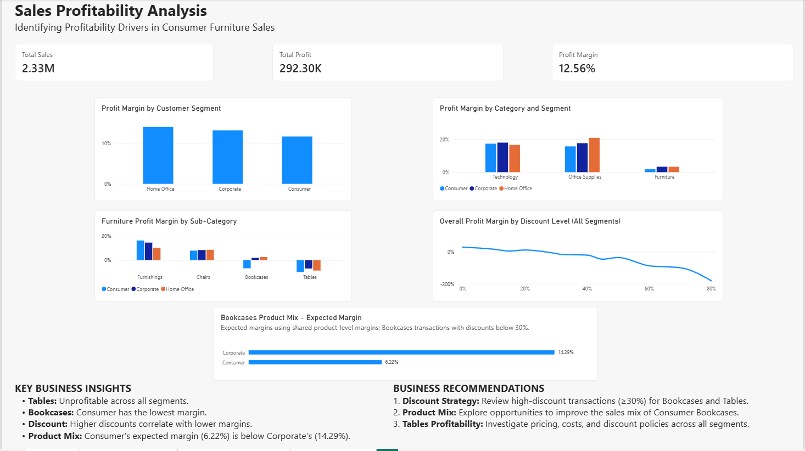

# Superstore Profitability Analysis

## Project Overview

This project analyzes profitability challenges in the Superstore dataset, focusing on the Consumer segment, Furniture products, discount strategies, and product sales mix.

The goal is to identify factors associated with lower profit margins and develop actionable business recommendations.

## Tools & Skills

- **Excel:** Data exploration and validation
- **MySQL:** Data analysis, aggregation, conditional calculations, and hypothesis testing
- **Power BI:** Interactive dashboard, DAX measures, and data visualization
- **Business Analysis:** Problem identification, root-cause investigation, and business recommendations

## Business Questions

1. Why does the Consumer segment have a lower profit margin?
2. Which product categories and sub-categories contribute to profitability challenges?
3. How are discounts associated with profitability?
4. Does product sales mix contribute to the Consumer profitability gap?

## Key Findings

**1. Furniture Profitability**

Furniture has a significantly lower profit margin than Technology and Office Supplies.

**2. Bookcases and Tables**

Tables has negative profit margins across all customer segments, while Bookcases performs particularly poorly in Consumer.

**3. Discount Analysis**

Higher discounts are associated with lower profit margins and greater losses.

**4. Product Mix Analysis**

Using shared product-level margins for Bookcases transactions with discounts below 30%:

- Consumer expected margin: **6.22%**
- Corporate expected margin: **14.29%**

This suggests that differences in product sales mix contribute to Consumer's weaker profitability.

## Business Recommendations

1. Evaluate whether high-discount promotions generate sufficient incremental sales and profit.
2. Explore opportunities to improve Consumer Bookcases product mix.
3. Investigate Tables pricing, costs, and discount policies across all segments.

## Limitations

Historical sales data cannot establish the causal impact of discounts on sales volume. Additional promotion, cost, and customer behavior data would improve the analysis.

## Project Deliverables

- SQL profitability analysis
- Power BI dashboard
- Final business analysis report

## Dataset

Sample Superstore retail sales dataset.

## Project Files

### Power BI Dashboard

### Analysis & Report

- [SQL Analysis](sql/profitability_analysis.sql)
- [Power BI Project](dashboard/Superstore_Profit_Discount_Analysis.pbix)
- [Final Business Report (PDF)](report/Superstore_Final_Business_Report.pdf)
